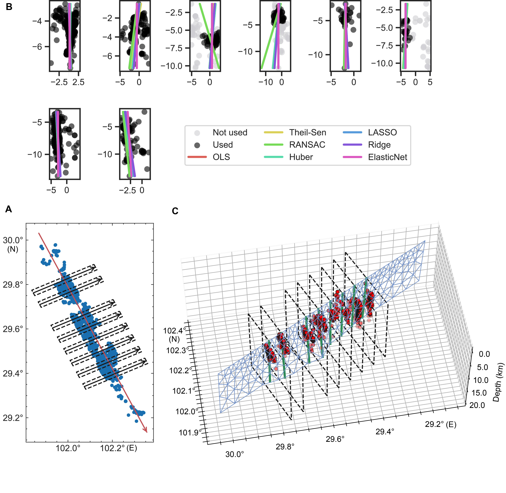

<div align="center">
  
</div>

 

 [](https://doi.org/10.5281/zenodo.13730101)   

</div>

---

## 📖 Introduction

**ECAT** is a unified framework for adaptive fault modeling and earthquake cycle analysis. It integrates fault constructing, forward modeling, data processing, and advanced inversion strategies into a comprehensive toolkit.

**Key Goals:**

* Provide robust tools for the entire **Forward and Inverse** earthquake cycle.
* Support complex fault geometries with adaptive meshing.
* Enable flexible hyperparameter estimation strategies (Single, Individual, Grouped).
* **Continuous Updates:** Stable features are integrated regularly, with ongoing bug fixes and new module additions.

---

## 🚀 Core Features & Workflow

### 1. Inversion Workflow & Strategies

ECAT supports a flexible inversion pipeline, ranging from standard step-wise inversion to advanced joint Bayesian optimization.

<p align="center">
  
</p>

* **Data Processing:**
  * **InSAR/Offset:** Supports Resolution-based (fault-dependent) and Quadtree-based (fault-independent) downsampling.
  * **GNSS:** Direct integration without downsampling.
* **Inversion Strategies:**
  * **Standard Two-Step:** Nonlinear geometry search followed by Linear slip inversion (BLSE/VCE).
  * **SMC-FJ (Joint Strategy):** Simultaneous estimation of **Geometry + Slip + Hyperparameters** using Bayesian optimization.
* **Hyperparameter Modes (Unique Feature):**
  For both Linear (BLSE; VCE) and Bayesian parts, data weights and smoothing factors can be estimated in three modes:
  * **Single:** Global factor for all datasets/faults (Default for smoothing).
  * **Individual (Default):** Independent factor for each dataset/fault-segment (Default for weighting).
  * **Grouped:** Cluster-based factors for user-defined groups.

### 2. Adaptive Fault Construction & Meshing

ECAT offers versatile methods to build complex fault geometries from various data sources.


* **Construction Modes:**
  1. **Planar:** Simple geometry from GCMT or nonlinear inversion results.
  2. **Listric:** Depth-dependent dip (exponential decay/SDM-style).
  3. **Trace + Profile:** Lofted surfaces defined by surface traces and variable dip profiles.
  4. **Contour:** 3D surfaces from Slab2.0 depth contours or iso-depth curves.
* **Meshing:**
  * **Triangular Elements (T3):** **Recommended** for complex, gap-free surfaces.
  * **Rectangular Elements (Q4):** Supported for simple planar geometries.

### 3. Forward Modeling Engines

ECAT utilizes layered Green's function calculations powered by `edcmp` and `pscmp`, supporting both rectangular and triangular elements.

> For details, see `README` in the `csi` subdirectory.


---

## 💻 Installation

See [Install.md](Install.md) for detailed instructions.

### Quick Start

```bash
# Clone the repository
git clone [https://github.com/kefuhe/ECAT.git](https://github.com/kefuhe/ECAT.git)
cd ECAT
# Run installation script
./install.sh  # Linux/Mac
# or install.bat for Windows
```

## 🔎 Case Studies (Coseismic)

### 1. Adaptive Fault Geometry with Relocated Aftershocks

#### Case 1: 2021 Maduo Earthquake (Mw 7.4)

<p align="center">


</p>

#### Case 2: 2023 Kahramanmaraş Türkiye Doublet

*Complex multi-segment modeling with variance dip angles.*


#### Case 3: 2022 Luding Earthquake

*Pre-Clustering Selection Followed by Fitting.*



### 2. Isocurve Fitting (Depth-focused Aftershocks)

*Note: Robust curve fitting serves as a reference. Final curves often incorporate user interaction.*


---

## 🚧 Modules in Development

### Postseismic (Beta)

* **Engine:** `pscmp_visco_postseismic.py`
* **Features:** Combined model of viscoelastic relaxation and stress-driven afterslip.
  * `cv_cum`: Viscoelastic relaxation due to coseismic slip.
  * `as_cum`: Afterslip calculation.
  * `calAS_AV`: Viscoelastic relaxation due to afterslip.

### Interseismic (Alpha)

* **Engine:** `pscmp_visco_interseismic.py`
* **Function:** `calviscoGfromPscmp` for earthquake cycle velocity calculations.

---

## 📝 Citation

If you use ECAT in your research, please cite:

> **He K., C. Xu, Y. Wen, Y. Zhao, G. Xu, L. Sun, and J. Wang (2025).**  A Unified Framework for Adaptive Fault Modeling: Methods and Applications. *SCIENCE CHINA Earth Sciences* . DOI: [10.1007/s11430-025-1773-0](https://doi.org/10.1007/s11430-025-1773-0)

---

<p align="center">
