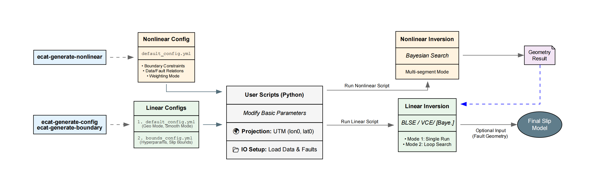
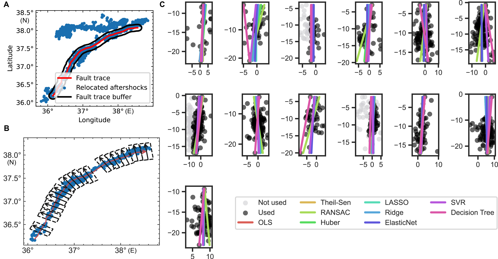
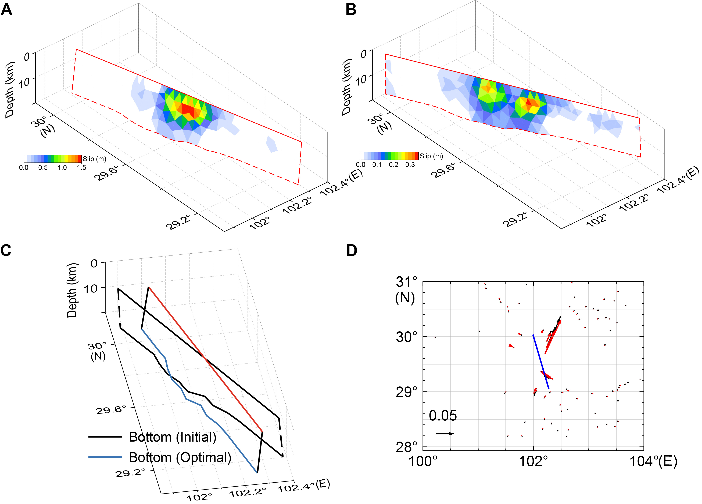
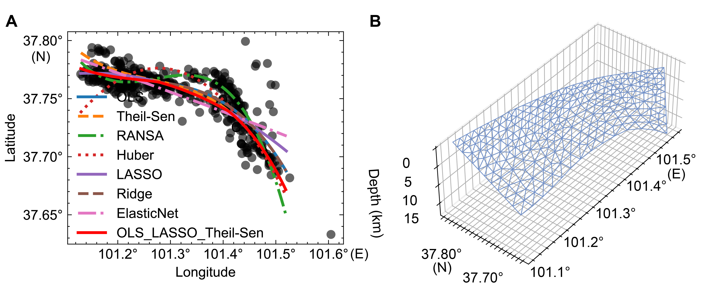
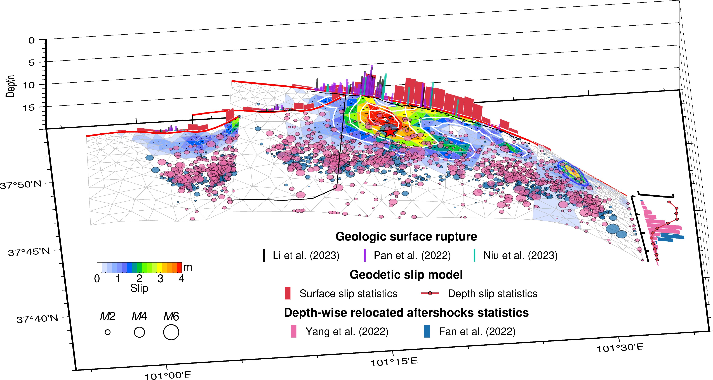
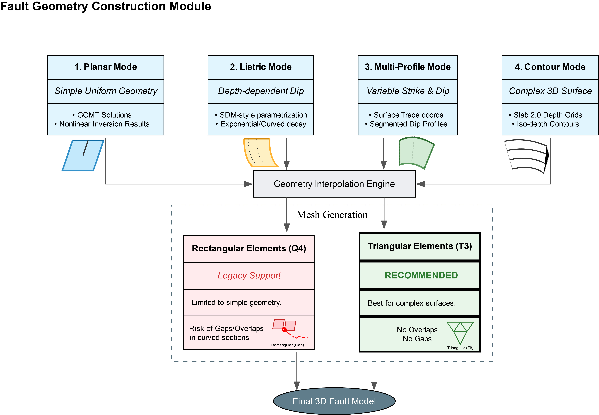
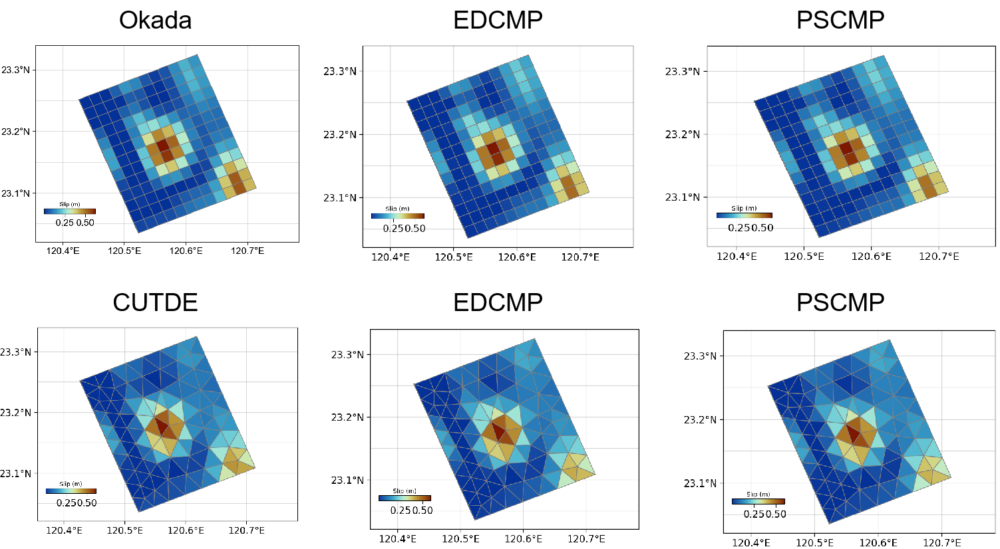

<div align="center">
  
</div>

 

 [](https://doi.org/10.5281/zenodo.13730101)   

</div>

---

## 📖 Introduction

**ECAT** is a unified framework for adaptive fault modeling and earthquake cycle analysis. It integrates fault constructing, forward modeling, data processing, and advanced inversion strategies into a comprehensive toolkit.

**Key Goals:**

* Provide robust tools for the entire **Forward and Inverse** earthquake cycle.
* Support complex fault geometries with adaptive meshing.
* Enable flexible hyperparameter estimation strategies (Single, Individual, Grouped).
* **Continuous Updates:** Stable features are integrated regularly, with ongoing bug fixes and new module additions.

---

## 💻 Installation

See [Install.md](Install.md) for detailed instructions.

### Quick Start

```bash
# Clone the repository
git clone [https://github.com/kefuhe/ECAT.git](https://github.com/kefuhe/ECAT.git)
cd ECAT
# Run installation script
./install.sh  # Linux/Mac
# or install.bat for Windows
```

-----

## 🏃 Running ECAT & Case Studies


ECAT relies on a rich library of cases for testing and research. To run ECAT effectively, you should first obtain the case library.

### 3.1 Get the Case Library (Basic Running)

The full case library is hosted in a separate repository (`ECAT-Cases`). You have two options to download it:

**Option 1: Auto-download via Install Script**
Uncomment the following line in `install.sh` / `install.bat` before running installation:

```bash
git submodule update --init --recursive
```

**Option 2: Manual Download**

```bash
# Using the helper script
./download_cases.sh

# Or direct clone into the directory
git clone [https://github.com/kefuhe/ECAT-cases.git](https://github.com/kefuhe/ECAT-cases.git)
```

### 3.2 Method & Example Modules

*Basic examples to understand specific modules of ECAT.*

| 🏷️ Category | ⚡ Earthquake Example | 📝 Description (Date, Magnitude, Type) | 📁 Directory (in `ECAT-Cases`) |
| :--- | :--- | :--- | :--- |
| **Downsampling** | InSAR Downsampling | Example code for InSAR downsampling | [Details](https://www.google.com/search?q=./Cases/InSAR_Downsampling/) |
| **Nonlinear Inversion** | [Hotan Earthquake](https://earthquake.usgs.gov/earthquakes/eventpage/us7000abmk/executive) | 2020-06-25, Mw6.3, Normal | [Details](https://www.google.com/search?q=./Cases/Hotan_20200625M6_3/) |
| | [Iran Earthquake](https://earthquake.usgs.gov/earthquakes/eventpage/us10008ei0/executive) | 2017-04-05, Mw6.1, Reverse | [Details](https://www.google.com/search?q=./Cases/Iran_20170405M6_1/) |
| | [Taiwan Earthquake](https://earthquake.usgs.gov/earthquakes/eventpage/us7000m9g4/executive) | 2024-04-05, Mw7.4, Reverse | [Details](https://www.google.com/search?q=./Cases/Taiwan_20240405Mw7_4/) |
| | [Wushi Earthquake](https://earthquake.usgs.gov/earthquakes/eventpage/us7000lsze/executive) | 2024-01-22, Mw7.0, Strike-slip | [Details](https://www.google.com/search?q=./Cases/Wushi_20240122M7_0/) |
| | [Western Xizang](https://earthquake.usgs.gov/earthquakes/eventpage/us6000b26j/executive) | 2020-07-22, Mw6.3, Normal | [Details](https://www.google.com/search?q=./Cases/Western_Xizang_20200722M6_3/) |
| **BLSE Linear Inversion** |  [Dingri Earthquake  2020](https://www.globalcmt.org/cgi-bin/globalcmt-cgi-bin/CMT5/form?itype=ymd&yr=2020&mo=3&day=18&otype=ymd&oyr=2020&omo=3&oday=21&jyr=1976&jday=1&ojyr=1976&ojday=1&nday=1&lmw=5&umw=10&lms=0&ums=10&lmb=0&umb=10&llat=28&ulat=29&llon=87&ulon=88&lhd=0&uhd=20&lts=-9999&uts=9999&lpe1=0&upe1=90&lpe2=0&upe2=90&list=5)                                                                            | 2020-03-20, Mw5.7, Normal                         | [Details](https://www.google.com/search?q=./Cases/Dingri_Events/Dingri_20200320Mw5_6/LinearInv/)     |

### 3.3 Real Earthquake Case Studies (Visual Gallery)

*Advanced applications demonstrating adaptive fault geometry and complex slip distribution.*

#### A. Adaptive Fault Geometry with Relocated Aftershocks

**Case 1: 2021 Maduo Earthquake (Mw 7.4)**

<p align="center">


</p>

**Case 2: 2023 Kahramanmaraş Türkiye Doublet**

*Complex multi-segment modeling with variance dip angles.*



**Case 3: 2022 Luding Earthquake**

*Pre-Clustering Selection Followed by Fitting.*


#### B. Isocurve Fitting (Depth-focused Aftershocks)

*Note: Robust curve fitting serves as a reference. Final curves often incorporate user interaction.*



<p align="center">
  
</p>

#### C. Comprehensive Research Cases List

| 🌏 Case Name | 📝 Description | 🔗 Link |
| :--- | :--- | :--- |
| **Dingri 2015** | 2015-04-25, Mw5.7, Normal | [Details](https://www.google.com/search?q=./Cases/Dingri_Events/Dingri_20150425Mw5_7/) |
| **Dingri 2020** | 2020-03-20, Mw5.6, Normal | [Details](https://www.google.com/search?q=./Cases/Dingri_Events/Dingri_20200320Mw5_6/) |
| **Dingri 2025** | 2025-01-07, Mw7.0, Normal | [Details](https://www.google.com/search?q=./Cases/Dingri_Events/Dingri_20250107Mw7_0/) |
| **Sagaing 2025** | 2025-03-28, Mw7.8, Strike-slip | [Details](https://www.google.com/search?q=./Cases/Sagaing_20250328Mw7_8/) |

---

## 🚀 Core Features & Workflow

### 1. Inversion Workflow & Strategies

ECAT supports a flexible inversion pipeline, ranging from standard step-wise inversion to advanced joint Bayesian optimization.

<p align="center">
  
</p>

* **Data Processing:**
  * **InSAR/Offset:** Supports Resolution-based (fault-dependent) and Quadtree-based (fault-independent) downsampling.
  * **GNSS:** Direct integration without downsampling.
* **Inversion Strategies:**
  * **Standard Two-Step:** Nonlinear geometry search followed by Linear slip inversion (BLSE/VCE).
  * **SMC-FJ (Joint Strategy):** Simultaneous estimation of **Geometry + Slip + Hyperparameters** using Bayesian optimization.
* **Hyperparameter Modes (Unique Feature):**
  For both Linear (BLSE; VCE) and Bayesian parts, data weights and smoothing factors can be estimated in three modes:
  * **Single:** Global factor for all datasets/faults (Default for smoothing).
  * **Individual (Default):** Independent factor for each dataset/fault-segment (Default for weighting).
  * **Grouped:** Cluster-based factors for user-defined groups.

### 2. Adaptive Fault Construction & Meshing

ECAT offers versatile methods to build complex fault geometries from various data sources.



* **Construction Modes:**
  1. **Planar:** Simple geometry from GCMT or nonlinear inversion results.
  2. **Listric:** Depth-dependent dip (exponential decay/SDM-style).
  3. **Trace + Profile:** Lofted surfaces defined by surface traces and variable dip profiles.
  4. **Contour:** 3D surfaces from Slab2.0 depth contours or iso-depth curves.
* **Meshing:**
  * **Triangular Elements (T3):** **Recommended** for complex, gap-free surfaces.
  * **Rectangular Elements (Q4):** Supported for simple planar geometries.

### 3. Forward Modeling Engines

ECAT utilizes layered Green's function calculations powered by `edcmp` and `pscmp`, supporting both rectangular and triangular elements.

> For details, see `README` in the `csi` subdirectory.



---

## 🚧 Modules in Development

### Postseismic (Beta)

* **Engine:** `pscmp_visco_postseismic.py`
* **Features:** Combined model of viscoelastic relaxation and stress-driven afterslip.
  * `cv_cum`: Viscoelastic relaxation due to coseismic slip.
  * `as_cum`: Afterslip calculation.
  * `calAS_AV`: Viscoelastic relaxation due to afterslip.

### Interseismic (Alpha)

* **Engine:** `pscmp_visco_interseismic.py`
* **Function:** `calviscoGfromPscmp` for earthquake cycle velocity calculations.

---

## 📝 Citation

If you use ECAT in your research, please cite:

> **He K., C. Xu, Y. Wen, Y. Zhao, G. Xu, L. Sun, and J. Wang (2025).**  A Unified Framework for Adaptive Fault Modeling: Methods and Applications. *SCIENCE CHINA Earth Sciences* . DOI: [10.1007/s11430-025-1773-0](https://www.sciengine.com/SCES/doi/10.1007/s11430-025-1773-0)

---

<p align="center">
