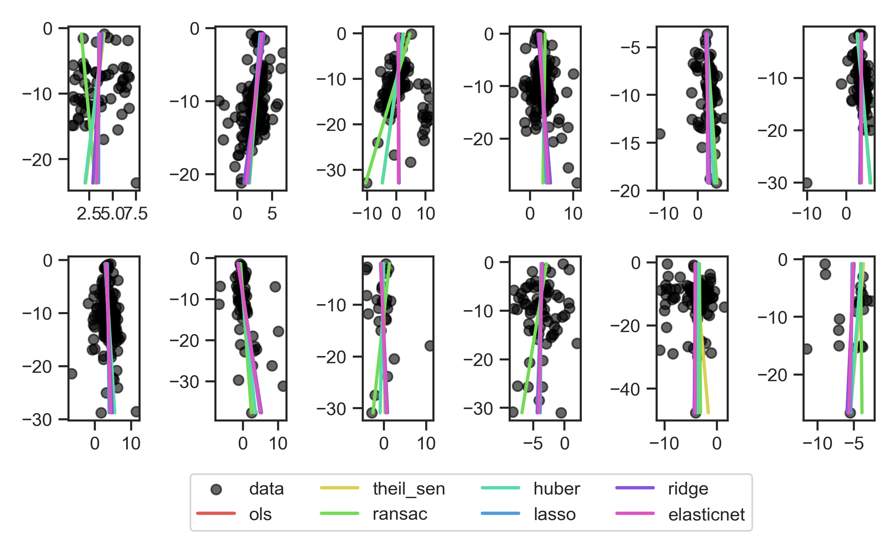
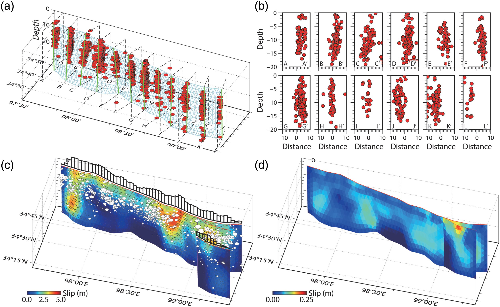
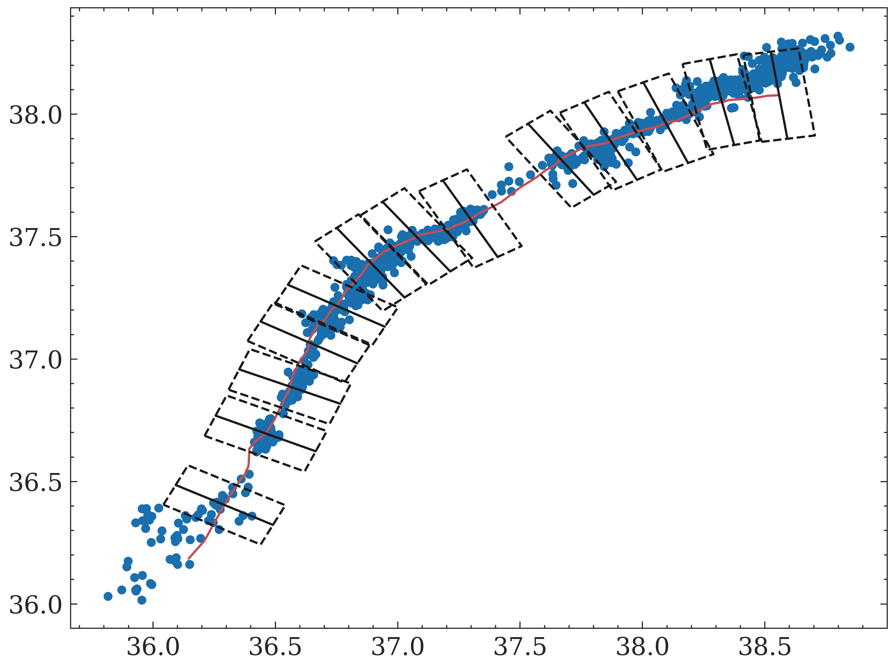
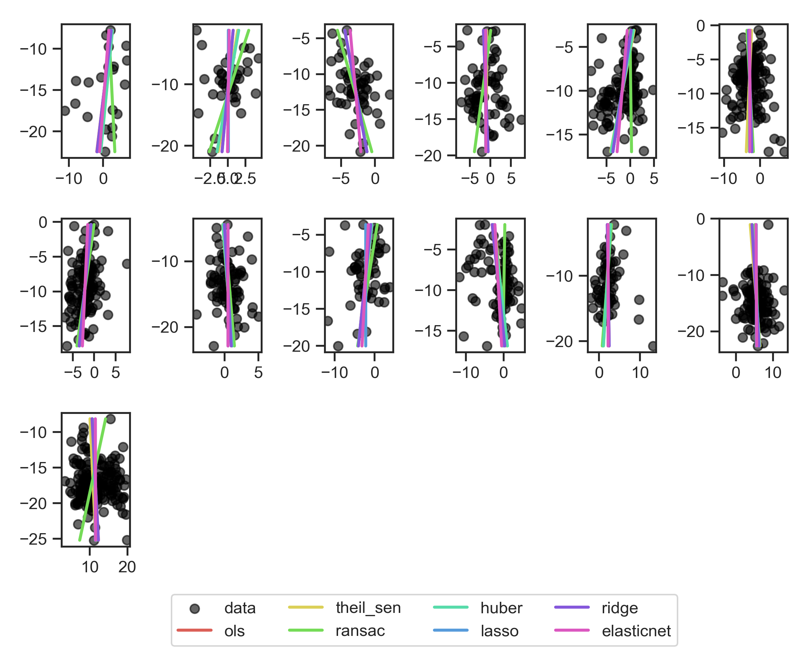
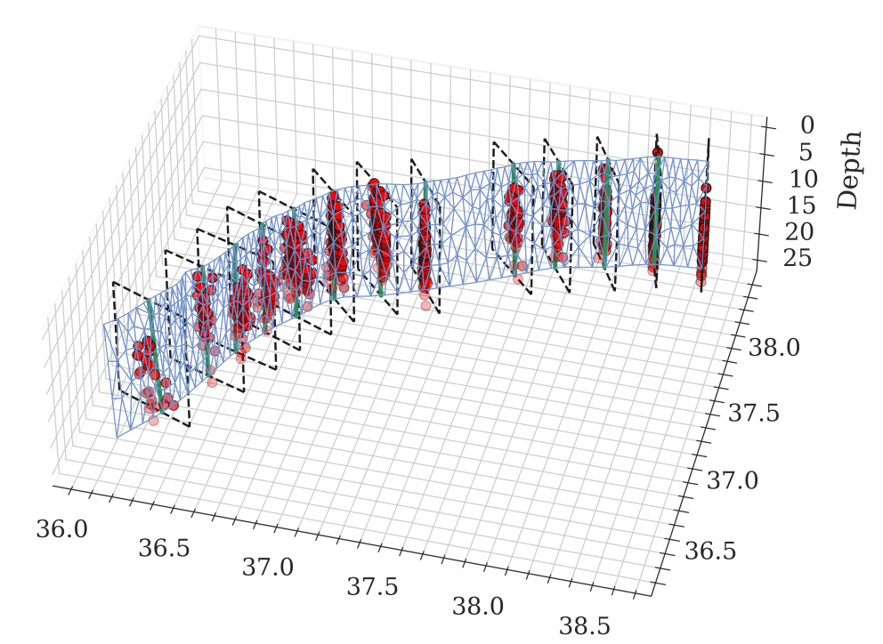
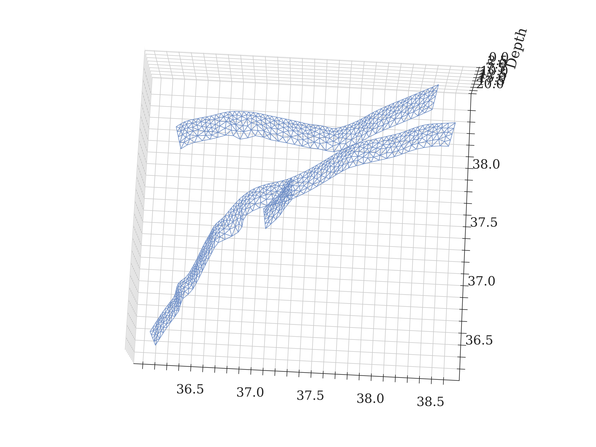
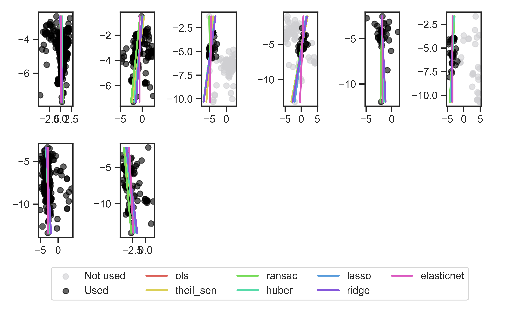
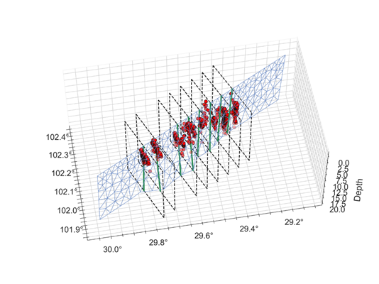
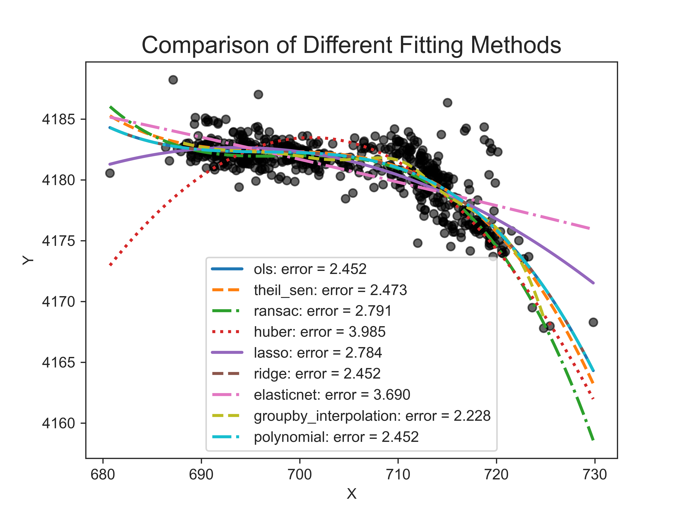

<div align="center">
  
</div>

 

 [](https://doi.org/10.5281/zenodo.13730101)   

</p>

# ECAT (Earthquake Cycle Analyse Toolkits)

---

**A set of tools related to the forward and inverse *earthquake cycle*.**

**Continue updating...**

* Stable code will gradually be incorporated
* New code will gradually be added
* Bug will gradually be fixed

---

## Installation

- See Readme ***Install.md***

## Download ECAT Case Library

The full ECAT case library, including research cases and advanced examples, is stored in a separate repository. To download the full case library, you have two options:

### Option 1: Enable Submodule Download in the Installation Script

1. Open the install.bat (Windows) or [install.sh](http://install.sh) (Linux/Mac) file.
2. Uncomment the following line:

```Bash
git submodule update --init --recursive
```

### Option 2: Download the Case Library Manually

If you prefer to download the case library manually, you can do so with the following script:

```bash
./download_cases.sh
```

Or download the case manually:

```bash
git clone https://github.com/kefuhe/ECAT-cases.git
```

## Coseismic （Uploaded）

### Building fault with variance dip angle determined by relocated aftershocks

1. **Case 1: 2021 Maduo earthquake**

<p align="center">
  
</p>



2. **Case 2: 2023 Kahramanmaraş Türkiye earthquake doublet**









3. **Case 3: 2022 Luding, China earthquake** (Pre-Clustering Selection Followed by Fitting)



<p align="center">
  
</p>

### Building fault with isocurve determined by depth-focused aftershocks

<p align="center">
  
</p


***Note:*** Various ***easy*** or ***robust*** curve fitting methods are only used as a reference to determine the ***isodepth curve***, and ultimately the final fitted curve may need to be extracted based on the user's own *background knowledge* or *visual interaction judgment*.

### Reference

[1] He, K., Y. Wen, C. Xu, and Y. Zhao (2021), Fault Geometry and Slip Distribution of the 2021 Mw 7.4 Maduo, China, Earthquake Inferred from InSAR Measurements and Relocated Aftershocks, Seismol. Res. Lett., 93(1), 8-20.

[2] He K, Xu C, Wen Y (2022), Coseismic and early post-seismic deformations due to the 2019 earthquake sequence in Ridgecrest, California. Geophysical Journal International, 230(2): 957-975.

[3] [jolivetr/csi: Classic Slip Inversion (github.com)](https://github.com/jolivetr/csi)

[4] [Gmsh 4.11.1](https://gmsh.info/doc/texinfo/gmsh.html)

[5] ...

### Citation

If you use this package in your research, please cite it as follows:

Kefeng He, Guangyu Xu, Longxiang Sun, Caijun Xu, Yangmao, Wen. (2025). ECAT: Integrated Nonlinear and Linear Inversion for Complex Fault Systems and Slip Distribution (Version 1.5.0). Zenodo. http://doi.org/10.5281/zenodo.13730101.

## Postseismic （Pending)

- pscmp_visco_postseismic.py
  - Simple calculating codes about ***Combined model of viscoelastic relaxation and stress-driven afterslip***
- Deformation components
  - CV (Viscoelastic relaxation due to coseismic): Function ***cv_cum(t, tobs, disp)***
  - AS (Afterslip): Function ***as_cum(t, disp0, tau_as=0.25, alpha=1.0)***
  - AV (Viscoelastic relaxation due to afterslip): Function ***calAS_AV(pscmpts, obsdate, eqdate, alpha, tau, unit='m', intp_tunit='Y', onlyAV=True, mcpu=4)***

### Reference

[1] Diao, F., R. Wang, Y. Wang, X. Xiong, and T. R. Walter (2018), Fault behavior and lower crustal rheology inferred from the first seven years of postseismic GPS data after the 2008 Wenchuan earthquake, Earth Planet. Sci. Lett., 495, 202-212, doi:10.1016/j.epsl.2018.05.020.

[2] Diao, F., R. Wang, X. Xiong, and C. Liu (2021), Overlapped Postseismic Deformation Caused by Afterslip and Viscoelastic Relaxation Following the 2015 *Mw* 7.8 Gorkha (Nepal) Earthquake, J. Geophys. Res.: Sol. Ea., 126(3), doi:10.1029/2020jb020378.

[3] He Ke., Y. Wen, C. Xu, W. Xiong, J. Zang (2023), In preparation.

## Interseismic (Pending)

- pscmp_visco_interseismic.py
  - Calculating velocity related to ***earthquake cycle***
- Main function
  - ***calviscoGfromPscmp***(pscmpts, T=None, diffint=None, unit='m')

### Reference

[1] Diao, F., X. Xiong, R. Wang, T. R. Walter, Y. Wang, and K. Wang (2019), Slip Rate Variation Along the Kunlun Fault (Tibet): Results From New GPS Observations and a Viscoelastic Earthquake‐Cycle Deformation Model, Geophys. Res. Lett., 46(5), 2524-2533, doi:10.1029/2019gl081940.

[2] Zhu, Y., K. Wang, and J. He (2020), Effects of Earthquake Recurrence on Localization of Interseismic Deformation Around Locked Strike‐Slip Faults, J. Geophys. Res.: Sol. Ea., 125(8), doi:10.1029/2020jb019817.

[3] Wang, K., Y. Zhu, E. Nissen, and Z. K. Shen (2021), On the Relevance of Geodetic Deformation Rates to Earthquake Potential, Geophys. Res. Lett., 48(11), doi:10.1029/2021gl093231.
