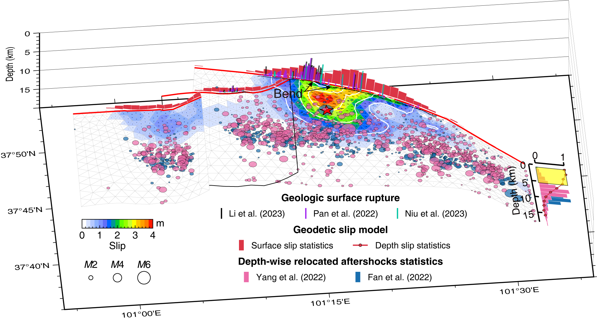

<div align="center">
  
</div>

 

 [](https://doi.org/10.5281/zenodo.13730101)   

</p>

# ECAT (Earthquake Cycle Analyse Toolkits)

---

## Forward Modeling Engines

***ECAT*** supports layered Green's function calculations for both rectangular and triangular elements, utilizing `edcmp` and `pscmp`.
For more details and configuration instructions, see the `README` file in the `csi` subdirectory.


**A set of tools related to the forward and inverse *earthquake cycle*.**

**Continue updating...**

* Stable code will gradually be incorporated
* New code will gradually be added
* Bug will gradually be fixed

---

## Installation

- See Readme ***Install.md***

## Download ECAT Case Library

The full ECAT case library, including research cases and advanced examples, is stored in a separate repository. To download the full case library, you have two options:

### Option 1: Enable Submodule Download in the Installation Script

1. Open the install.bat (Windows) or [install.sh](http://install.sh) (Linux/Mac) file.
2. Uncomment the following line:

```Bash
git submodule update --init --recursive
```

### Option 2: Download the Case Library Manually

If you prefer to download the case library manually, you can do so with the following script:

```bash
./download_cases.sh
```

Or download the case manually:

```bash
git clone https://github.com/kefuhe/ECAT-cases.git
```

## Coseismic （Uploaded）

### Building fault with variance dip angle determined by relocated aftershocks

1. **Case 1: 2021 Maduo earthquake**

<p align="center">
  
</p>


2. **Case 2: 2023 Kahramanmaraş Türkiye earthquake doublet**


3. **Case 3: 2022 Luding, China earthquake** (Pre-Clustering Selection Followed by Fitting)


<p align="center">
  
</p>

### Building fault with isocurve determined by depth-focused aftershocks

<p align="center">
  
</p



***Note:*** Various ***easy*** or ***robust*** curve fitting methods are only used as a reference to determine the ***isodepth curve***, and ultimately the final fitted curve may need to be extracted based on the user's own *background knowledge* or *visual interaction judgment*.

### Citation

If you use this package in your research, please cite it as follows:

He K., C. Xu, Y. Wen, Y. Zhao, G. Xu, L. Sun, and J. Wang (2025), A Unified Framework for Adaptive Fault Modeling: Methods and Applications, SCIENCE CHINA Earth Sciences. doi: [10.1007/s11430-025-1773-0](https://doi.org/10.1007/s11430-025-1773-0 "https://doi.org/10.1007/s11430-025-1773-0").

## Postseismic （Pending)

- pscmp_visco_postseismic.py
  - Simple calculating codes about ***Combined model of viscoelastic relaxation and stress-driven afterslip***
- Deformation components
  - CV (Viscoelastic relaxation due to coseismic): Function ***cv_cum(t, tobs, disp)***
  - AS (Afterslip): Function ***as_cum(t, disp0, tau_as=0.25, alpha=1.0)***
  - AV (Viscoelastic relaxation due to afterslip): Function ***calAS_AV(pscmpts, obsdate, eqdate, alpha, tau, unit='m', intp_tunit='Y', onlyAV=True, mcpu=4)***

## Interseismic (Pending)

- pscmp_visco_interseismic.py
  - Calculating velocity related to ***earthquake cycle***
- Main function
  - ***calviscoGfromPscmp***(pscmpts, T=None, diffint=None, unit='m')
