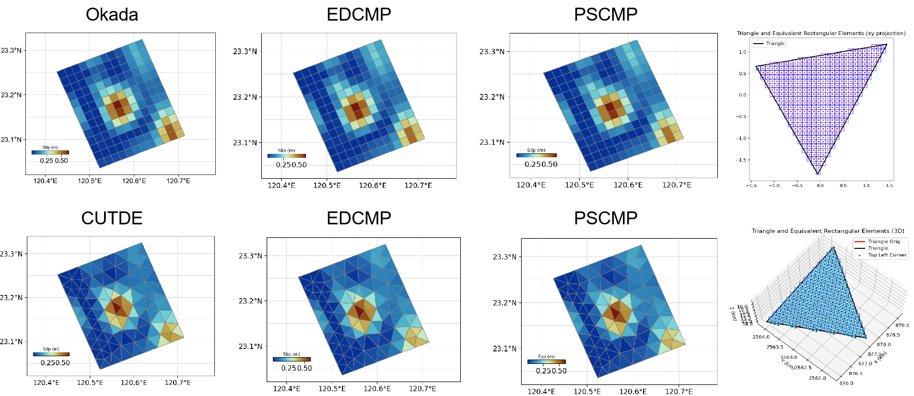

# csi

Classic Slip Inversion (CSI)  
_Pythonic Version with Layered and Triangular Green's Function Support_

---

> ⚡️ **Based on [CSI](https://github.com/jolivetr/csi), with further compatibility improvements, optimizations, and feature extensions by Kefeng He.**  
> **Note:** This version is **not fully compatible** with the original CSI. Please be aware that the two versions are not direct drop-in replacements.

---

## ✨ Features

### Forward Modeling Engines

***ECAT*** supports layered Green's function calculations for both rectangular and triangular elements, utilizing `edcmp` and `pscmp`.
For more details and configuration instructions, see the `README` file in the `csi` subdirectory.


- **🟩 Green's Function Calculation**
  - 🚀 Parallel computation of triangular dislocation element Green's functions using [cutde](https://github.com/cutde-org/cutde).
  - 🏗️ Layered Green's function calculation via EDCMP ([original repo](https://github.com/RongjiangWang/EDGRN_EDCMP_2.0)) and PSCMP ([original repo](https://github.com/RongjiangWang/PSGRN-PSCMP_2020)).
  - 📦 EDCMP and PSCMP binaries are pre-packaged in `csi/bin`:
    - 🪟 Windows: `.exe` files.
    - 🐧 Linux: binaries compiled under Ubuntu 20.04 (other Linux distributions may require manual compilation; see below).
  > ⚠️ **Note:** The `fomosto_psgrn2008a.exe` and `fomosto_pscmp2008a.exe` binaries currently provided in `csi/bin` are **not functional**. This means that the PSCMP-mode Green's function calculation is **not available on Windows** at this time.

---

## GPS fit comparison

`gps.plot_fit_comparison()` adds a single 2-D comparison figure; `gps.plot()`
retains its existing map behavior. Prepare `gps_data.synth` from the intended
model before plotting. The renderer never solves or rebuilds predictions.

```python
fig, ax = gps_data.plot_fit_comparison(
    vertical=True,  # explicitly include U only when it belongs to the comparison
    value_scale=1000.0,  # arrays currently in m -> display in mm
    value_unit="mm",
    arrow_scale=500.0,  # displayed-value units per inch
    legend_value=100.0,
    vertical_sizes=(64, 25),  # observed/model areas, in points squared
    style="science",
    style_kwargs={"fontsize": 9},  # direct ecat_viz PlotStyle options
    show=False,
)
fig.savefig("gps_comparison.pdf", dpi=300, bbox_inches="tight")
```

Observed/model EN arrows have identical width and head geometry, using red/blue
by default. Optional Up is signed color: the observed outer ring and model inner
disk share one colorbar. Marker size distinguishes roles, not displacement
magnitude. `vertical=False` hides U, including any unused zero storage column.

The default `coordinates="lonlat"` is a regional, non-polar view with local
latitude aspect correction. Degree ticks remain visible; longitude/latitude
axis titles are hidden by default. `xlabel` and `ylabel` explicitly override
titles. Select `coordinates="xy"` for the GPS object's projected km frame and
true-EN-to-grid directions. `extent` and ticks use the chosen coordinate units;
existing kilometre extents must explicitly select `xy`.

Each red/blue legend bar represents the same `legend_value`, with one centered
magnitude above both bars. Its physical length is `legend_value / arrow_scale`
inches, matching the horizontal arrows independently of font size, DPI and map
units. No separate black arrow key is drawn. `legend_loc` controls this combined
legend; old `key_position` emits a migration warning. The arrow scale still
uses the original EN magnitude, and observed/model arrow geometry remains equal.

The signed-U colorbar defaults to vertical, outside the right edge, aligned
with the main axes' bottom spine. `colorbar_size=0.35` gives 35% of the final
axes height. Choose `colorbar_orientation="horizontal"` for a bar below the
axes, where size is a fraction of axes width. An explicit `cbaxis` overrides
automatic geometry; historical horizontal insets must also specify horizontal
orientation. Marker areas default to `(64, 25)` points squared.

Display conversion is explicit and leaves observations, synth, errors and Cd
unchanged. `unit="inch"/"cm"` refers to figure size, while `value_unit` labels the
scientific values. Missing observed/model pairs are omitted with warnings;
missing synth or an entirely empty comparison raises an error. `error=True`
uses independent marginal E/N `err_enu` standard deviations, not full Cd or VCE
uncertainties; it is off by default.

The method returns ordinary Figure/Axes and accepts a borrowed `ax`. It does not
overwrite the legacy `gps_data.fig`; borrowed figures cannot be closed by it.
See `help(gps.plot_fit_comparison)` for all parameters and the numbered rendering
steps in `csi/_gps_plotting.py` for implementation semantics. ECAT high-level
usage and migration controls are documented in
[Figure Products](https://github.com/kefuhe/ECAT/blob/main/docs/reference/figure_products.md#gps-单图比较).

## 🚦 Installation and Usage Notes

CSI's general plotting helpers now depend directly on `ecat-viz` (`ecat_viz`),
not eqtools. For a local standalone checkout, install the sibling `ecat-viz`
project with `python -m pip install .` first; ECAT installs all three local
components together. Numerical source/mesh/Green-function behavior is unchanged
by this plotting migration.

The aligned ECAT release also includes CSI's source-component prediction
protocol. `buildsynth(direction="source")` follows each fault's `slipdir` and
requires Green functions for its declared components; explicit legacy
directions such as `"sd"` retain their existing behavior. This is a source
diagnostic, while eqtools' formal linear fit uses its assembled `G @ mpost`.
Update all three local components together when crossing this release boundary;
installing the plotting package alone cannot upgrade an older CSI implementation.


For a new user environment, install the complete
[ECAT distribution](https://github.com/kefuhe/ECAT) first. Its supported
dependency file, matching `okada4py` instructions, and installation scripts
prepare ecat-viz, CSI and eqtools together.

For independent CSI development, reuse the validated ECAT environment and run
the editable package install from this repository root:

```bash
conda activate ecat
python -m pip install -e .
```

This is an incremental package install, not a complete environment bootstrap.
CSI imports `okada4py` during package import, so a matching wheel must already
be installed. The direct Python dependencies are declared in `setup.py`.
Every base entry is backed by a CSI source import; a package is not added here
merely because eqtools uses it. Dependencies imported by both CSI and eqtools
are deliberately declared by both packages so either standalone checkout can
be installed without relying on the other package's metadata.

The obsolete CSI `simpleSampler` implementation based on the incompatible
legacy PyMC API has been removed. PyMC, PyTensor, and Theano are not CSI or
ECAT installation dependencies; supported nonlinear geometry inversion is
provided by the eqtools Bayesian SMC workflow.

- **If you only need homogeneous (non-layered) Green's function calculation:**
  no EDCMP/PSCMP binary compilation is required. After preparing the ECAT
  environment, install this checkout with:

  ```bash
  python -m pip install -e .
  ```

- **If you need layered Green's function calculation (EDCMP/PSCMP):**
  - On **Windows**:  
    Pre-built `.exe` binaries are included and will be used automatically.
  - On **Linux**:  
    - Binaries for Ubuntu 20.04 are included by default.
    - If you are on another Linux distribution, you may need to compile EDCMP/PSCMP yourself:
      1. Compile the binaries on your platform (see below for source and patch instructions).
      2. Replace the binaries in the corresponding `csi/bin` subfolder.
      3. Then run `python -m pip install -e .` to install the package.

---

## Observation selection and plotting contracts

In CSI 1.0.1, crossfaultoffset station selection/rejection keeps coordinates, observations,
errors, existing component/combined predictions and covariance aligned. Covariance uses
component-major rows based on the original station count, including cross-component correlations.
Inconsistent shapes raise before observation state is changed. Select before GF/solver assembly;
after later selection, rebuild external source GFs, data layouts and solver covariance factors.
Earlier multi-component select_stations calls made after Cd construction could select wrong
covariance rows. Recompute weighted fits/inversions that used that branch.

CSI requires ecat-viz 0.1.1 or newer within the supported 0.1 series. Invalid plotting style
arguments propagate; style=None explicitly disables styling. CSI alone installs ecat-psgrn;
the old eqtools module delegates to CSI. Upgrade all ECAT components together and reinstall
CSI last when upgrading an environment whose old packages both owned that command.

---

## 🛠️ Compiling and Binary Notes

- **PSCMP Dependency Notice**
  - PSCMP binaries are compiled from [pyrocko/fomosto-psgrn-pscmp](https://github.com/pyrocko/fomosto-psgrn-pscmp).
  - **Before compiling**, you must modify the input file reading section in the Fortran source code as follows (not present in the original code, you need to update manually):

    <details>
    <summary>psgmain.f</summary>

    ```fortran
    write(*,'(a,$)') ' Please type the file name of input data: '
    c      read(*,'(a)')inputfile
    call getarg(1, inputfile)
    write(*,*) inputfile
    runtime=time()
    open(10, file=inputfile, status='old')
    ```

    </details>

    <details>
    <summary>pscmain.f</summary>

    ```fortran
    write(*,'(a,$)') ' Please type the file name of input data: '
    call getarg(1, infile)
    write(*,*) infile
    open(10, file=infile, status='old')
    ```

    </details>

    Similarly, update `edgmain.f` and `edcmain.f` to use `getarg` for input file arguments before compiling.

- **Compiling EDCMP/EDGRN**
  - For EDCMP/EDGRN, simply use `gfortran` to compile the source code.

- **🐧 Linux Library Dependencies**
  - For PSCMP binaries on Ubuntu 20.04, you may need to install `libgfortran3` and `gcc-6-base`.  
    See this [gist for details](https://gist.github.com/sakethramanujam/faf5b677b6505437dbdd82170ac55322#installing-libgfortran3-on-ubuntu-2004).
    - Download:
      - [`libgfortran3`](http://archive.ubuntu.com/ubuntu/pool/universe/g/gcc-6/libgfortran3_6.4.0-17ubuntu1_amd64.deb)
      - [`gcc-6-base`](http://archive.ubuntu.com/ubuntu/pool/universe/g/gcc-6/gcc-6-base_6.4.0-17ubuntu1_amd64.deb)
    - Install in order:
      ```bash
      sudo dpkg -i gcc-6-base_6.4.0-17ubuntu1_amd64.deb
      sudo dpkg -i libgfortran3_6.4.0-17ubuntu1_amd64.deb
      ```
    - ⚠️ _This may affect your existing GCC installation. Proceed with caution._

---

## 🖥️ Command Line Tools via ECAT

After installing the full [ECAT package](https://github.com/kefuhe/ECAT), the following commands are available for direct use in the terminal:

| 🛠️ Command                        | 📄 Description                        |
|------------------------------------|---------------------------------------|
| `ecat-psgrn`                       | Run PSGRN                             |
| `ecat-pscmp`                       | Run PSCMP                             |
| `ecat-edgrn`                       | Run EDGRN                             |
| `ecat-edcmp`                       | Run EDCMP                             |
| `ecat-generate-psgrn-template`     | Generate PSGRN input file template    |
| `ecat-generate-pscmp-template`     | Generate PSCMP input file template    |
| `ecat-generate-edgrn-template`     | Generate EDGRN input file template    |
| `ecat-generate-edcmp-template`     | Generate EDCMP input file template    |

These commands correspond to running the respective programs or generating input file templates for each module.

---

## 📚 References

- [CSI (original)](https://github.com/jolivetr/csi)
- [cutde](https://github.com/cutde-org/cutde)
- [EDGRN/EDCMP (original)](https://github.com/RongjiangWang/EDGRN_EDCMP_2.0)
- [PSGRN/PSCMP (original)](https://github.com/RongjiangWang/PSGRN-PSCMP_2020)
- [Fomosto PSCMP (repackaged)](https://github.com/pyrocko/fomosto-psgrn-pscmp)

---

For usage instructions and examples, see the documentation and code comments.
