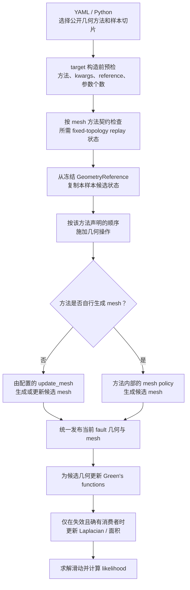
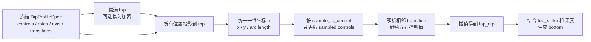

# Bayesian 联合反演中的几何参考

联合 Bayesian 反演不会在上一粒子的断层上继续累加扰动。每个样本都从同一份冻结的
`GeometryReference` 出发，生成本样本的候选几何，再更新网格、Green's functions
和线性滑动子问题。

核心不变量是：

```text
candidate_i = transform(reference, delta_i)
```

而不是：

```text
candidate_i = transform(candidate_(i-1), delta_i)
```

这保证了样本顺序不会改变几何含义，也避免长链中出现累计漂移。

## 一个样本从配置到似然的完整流转

普通用户只选择公开几何扰动方法、该方法在样本向量中的切片、参数 bounds 和公开
kwargs。方法内部怎样拆分几何操作、选择节点和安排顺序，由已注册方法本身定义，不需要
也不应在 YAML 中拼装内部 stage。



这里的“发布”表示把候选 `top/bottom/layers` 或 `Vertices/Faces` 变成当前 fault 的权威
状态，并同步其 patches 与必要缓存。用户不手工设置 GF、Laplacian 或面积的有效性标志；
反演层依据几何变化性质和本次计算实际需要统一调度。`SMC_FJ` 与 `FULLSMC` 使用同一套
候选几何刷新链，差别在采样和似然组织，不在 reference 或 mesh 发布契约。MPI 下每个
rank 维护自己的候选和缓存，pipeline 不为每个候选增加额外的跨 rank 通信。

非分层沿走向倾角方法在同一候选 pipeline 内再遵守一条更具体的单向流：



声明顺序负责参数映射，空间顺序只负责插值；两者不会互相覆盖。诊断图也读取同一 resolver
的不可变结果，因此不会出现“图中投影位置”和“候选实际计算位置”各用一套逻辑。

mesh replay 检查按注册方法的明确契约触发，不从方法后缀或已有数组名称猜测。
`generate_and_deform_mesh` 需要采样前准备的逐顶点参数映射，因此 target 构造会只读核对
映射与当前固定拓扑及重放参数；其他 mesh 路径没有声明该依赖时不会参与。该核对每次
target 构造执行一次，不放入单个样本的 pipeline，也不会替用户自动 remap。

profile 或 densification setter 会用不可变替换生成新的 `GeometryReference`。此时 current
top/bottom 与已有 parametric mapping 仍属于旧 reference；系统用运行时 provenance 标记这一
事实。只有候选 pipeline 完整物化新 reference 后，才能执行一次性的
`generate_and_deform_mesh(remap=True)`。准备好的 mapping 也绑定该 reference；随后若再改
profile 或 densification，target 构造会拒绝旧 mapping。该标记不进入 YAML、样本向量或
后验文件，也不在每个候选中散列大数组。

启用非分层 dip-profile 加密时，还区分 trace 节点、profile 求值节点和 mapping 节点。原始
top 折点只在真实平面弧长上加密，不被全局等距重采样删除；control 与 transition endpoint
作为求值事件插入同一折线，但不成为 Gmsh top curve 的新几何控制点。未启用加密时保持既有
top 节点求值语义。固定拓扑 mapping 继续使用 top 和 bottom 各自真实弧长上的归一化位置
$\xi$，不是按同一绝对弧长配对。完整公式和调用顺序见
[混合控制倾角剖面](../reference/dip_profile/bayesian_mixed.md)。

## 四个容易混淆的状态

| 状态 | 典型字段或对象 | 生命周期 | 是否应由用户直接修改 |
| --- | --- | --- | --- |
| 构建中的当前几何 | `top_coords`、`bottom_coords`、`layers`、`Vertices/Faces` | 采样前构建和检查 | 可以，通过公开建模接口修改 |
| 冻结参考 | `fault.geometry_ref` / `GeometryReference` | 一次 inversion run 的零扰动基线 | 不直接改字段；用 fault 的公开接口生成新参考 |
| 样本状态 | `GeometryState` | 单个样本内部 | 不需要；由 pipeline 创建 |
| 候选当前几何 | fault 上物化后的坐标、mesh 和 patches | 单个样本内部 | 不需要；由 pipeline 更新 |

`GeometryReference` 是不可变值对象。`with_dip_profile()`、`with_layers()`、
`with_vertices()` 和 `with_densification()` 会返回新对象；普通用户优先调用断层对象上的
`snapshot()`、`set_dip_profile()` 和 `set_densification()`，不要直接给
`geometry_ref` 的字段赋值。

## `snapshot()` 到底保存了什么

`snapshot()` 是一次**状态捕获**，不是一次 mesh 重建。调用时，它会把当前断层对象上已
完成检查的 top/bottom 等字段复制到新的 `GeometryReference`，把其中的数组设为只读，
再同时赋给 `fault.geometry_ref` 并作为返回值返回：

```python
ref = fault.snapshot(
    capture_vertices=False,
    capture_layers=False,
)

assert ref is fault.geometry_ref
assert not ref.top_coords.flags.writeable
```

参考数组和当前建模数组相互独立。之后改变 `fault.top_coords`、`fault.bottom_coords` 或
mesh，不会反向改变已冻结的 reference。`snapshot()` 本身也不会修改当前边界、生成 mesh、
改写先验或写入 YAML/结果文件；构建脚本需要在每次新运行中重新建立同一份参考。
在 MPI 运行中，每个 rank 都有自己的进程内 reference；它们应由相同输入和相同调用顺序
确定性建立，而不是假定一个普通 Python 对象会自动跨进程共享。

采样时，扰动 pipeline 从 `fault.geometry_ref` 复制出单样本 `GeometryState`，施加当前
样本的增量，再把候选边界或 mesh 物化到 fault 上。候选状态只服务于当前样本，不会回写
reference。因此 reference 服务的是“为所有样本定义共同零点”，而不是保存每个样本的
历史。

## 参考不是先验，也不是参数位置

以下四项共同定义一次几何采样，但作用不同：

| 项目 | 回答的问题 |
| --- | --- |
| `geometry_ref` | 零扰动时的断层是什么样？ |
| `geometry.sample_positions` | 全局样本向量的哪一段属于该断层？ |
| `update_fault_geometry.method` | 怎样把这段样本增量施加到参考几何？ |
| bounds 文件中的 `geometry` | 这些增量允许落在什么范围？ |

例如 `sample_positions: [0, 1]` 表示使用半开区间 `[0, 1)`，也就是一个几何采样量；
它不表示第 0 和第 1 个断层节点。一个标量是否广播到多个底边节点，由所选扰动方法定义。

## 参考应包含什么

`GeometryReference` 至少服务于所选扰动方法。它可以包含：

- `top_coords` 和 `bottom_coords`：边界坐标类扰动的基础。
- `layers`：多层断层和 layered mesh 的基础。
- `vertices` 和 `faces`：整体平移、旋转等直接变换现有 mesh 的方法所需。
- `dip_profile`：非分层沿走向倾角的 controls、sampled/fixed 角色、一维坐标和过渡区。
- `densification`：稀疏采样控制点到密集网格边界的加密策略。

非分层 transition 尚未确定时，可以先只建立含 `top_coords` 的最小 reference，运行
[reference-top 曲率预分析](../reference/dip_profile/transition_preflight.md)，再把审阅后的显式
endpoints 写入 `dip_profile`。分析结果绑定 top fingerprint，但不是 reference 的新字段，也不
进入候选状态。

生成型非分层 dip profile 的最小权威输入是 `top_coords + dip_profile`，再加可选
`densification`。bottom 是每个候选的派生输出，不属于必须 snapshot 的独立输入；把零扰动
bottom snapshot 回 reference 会把生成器输出误提升成第二套基线。独立 top/bottom、layers
和 whole-mesh 模式仍按各自权威状态显式 snapshot。

`set_dip_profile()` 不等同于“每次都冻结当前 top”。对象还没有 `geometry_ref` 时，它会捕获
当前 top，建立最小 generator reference；已经存在 reference 时，它只替换 profile，并继续
使用原来冻结的 top，不会把某个已物化候选静默提升为新基线。确实要开始一轮采用新 top 的
独立计算时，应在候选循环之外明确刷新完整基线；只有 profile 定义也改变时才重新声明；
`refresh_geometry_baseline()` 只服务于这种有意的高级重设，不属于普通候选流程。

不是所有场景都要捕获全部字段。只移动底边坐标、随后单独重建 mesh 时，
`snapshot(capture_vertices=False, capture_layers=False)` 已足够；直接变换整个 mesh 时，
必须在最终参考 mesh 建好后使用
`snapshot(capture_vertices=True, capture_layers=False)`。多层方法才需要捕获 `layers`。

对直接操作整张三角网格的方法，`vertices` 和 `faces` 是一个不可拆分的参考 pair：它们必须
来自同一次最终 mesh 捕获。只有其中一个字段、或者冻结后又改变了当前 Faces 的 row、编号、
绕序或连接关系，都不能再解释为同一基线。此时应先完成最终 remesh 和必要检查，再重新
`snapshot(capture_vertices=True, ...)`；系统不会把 frozen vertices 与当前 Faces 拼在一起。
这个约束只属于 whole-mesh 方法，不会把只需 top/bottom、layers 或 dip profile 的最小
reference 变成非法状态。

## 一个样本内部怎样组合多个操作

每个候选只有一份临时 `GeometryState`。同一候选中的坐标 stage 按声明顺序连续作用在这份
状态上，最后再由 mesh policy 生成或更新 mesh，并一次性写回 fault：

```text
GeometryReference
  -> candidate GeometryState
  -> stage 1 -> stage 2 -> ...
  -> mesh policy
  -> 一次 materialize
```

因此组合旋转和平移的含义是 `translate(rotate(reference))`，而不是每一步都重新读取
reference，也不是从上一样本继续累加。公开方法
`perturb_dips_with_preset_params_and_rigid_transform()` 支持“由 top/profile 生成 candidate
bottom，再同时旋转和平移 candidate top/bottom，最后由独立 mesh policy 更新固定拓扑”。
它不等同于先生成一张新 mesh 再额外旋转其 vertices。不要把边界生成 reference 与已有
whole-mesh reference 手工混合；其他 mixed 流程仍应使用有明确阶段契约的专用 composite。

## 入口由权威状态决定

“曲线断层”不是一个 reference 入口。应先回答：哪一份状态才是经过科学检查、需要定义
零扰动几何的权威输入？

```text
最终 top/bottom 已由迹线、倾角或外部坐标明确确定？
├─ 是：直接 snapshot；不先生成临时 mesh
└─ 否：权威边界是否只存在于已导入或修整后的 mesh？
   ├─ 是：从 mesh 提取边界并建立 reference
   └─ 否：先完成几何构建，不能让 snapshot 猜测基线
```

只有直接变换 mesh 顶点的方法才要求“先建最终 mesh，再捕获 vertices/faces”。边界坐标类
扰动通常应先冻结 top/bottom，再由同一组边界生成一次参数化 mesh。

## 何时建立或重新定义参考

推荐在以下时机建立参考：

1. 准备冻结的 top/bottom，以及所需的 layer、dip control 或 mesh 字段已完成科学检查。
2. 点序、下倾侧、深度和坐标单位已经确定；若方法直接变换 mesh，拓扑和网格尺度也已确定。
3. 即将创建 `BayesianMultiFaultsInversion` 或开始一次新的独立采样运行。

只在以下场景重新定义参考：

- 修正了输入迹线、边界、倾角控制点或初始 mesh，并准备重新开始一次 inversion run。
- 上一次反演得到新的代表几何，明确要把它作为下一次独立反演的零扰动中心。
- 做阶段化敏感性分析，每个阶段有清楚记录的不同基线。

不要在 SMC 目标函数、样本循环、单个 stage 内或恢复同一次 run 时调用
`snapshot()`。否则参数边界仍表示旧基线的增量，而样本实际围绕新基线解释，后验会失去
一致含义。进程重启后恢复同一次 run 时，应从原输入重建语义相同的 reference，不能把
中断时最后一个候选几何冻结成新零点。

## 两种 snapshot 不同

```python
fault.snapshot(
    capture_vertices=False,
    capture_layers=False,
)
```

冻结的是断层几何参考。

```python
snapshot = inversion.get_constraint_snapshot(validate=True)
```

返回的是 bounds、线性约束及其验证状态的诊断副本。它不会建立或刷新断层几何参考。

## 继续阅读

- [联合 Bayesian workflow](../workflows/05_joint_bayesian_geometry_slip.md)
- [联合几何设置短例](../examples/joint_bayesian_geometry_setup.md)
- [可扰动断层几何参考](../reference/geometry_perturbation.md)
- [断层几何状态](fault_geometry_states.md)
