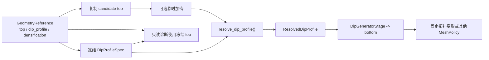

# 模式四：Bayesian sampled/fixed/transition 组合

这一模式用于非分层 Bayesian 几何扰动和需要候选重放的固定拓扑比较。它把自由倾角、固定
倾角、插值坐标和渐变区冻结为一个 `DipProfileSpec`，所有候选和诊断消费同一个 resolver。

如果 controls 已经确定、只准备一个固定几何运行 BLSE/VCE，不需要本页的 `snapshot()`、
候选期加密重放或 mapping。请直接使用
[固定几何中的倾角剖面](fixed_geometry.md)。

## 组合模型

```text
DipProfileSpec
├── sampled_controls      # 消费候选参数
├── fixed_controls        # 保持参考 dip
├── interpolation_axis    # auto | x | y | arc_length
└── transition_zones      # 定义渐变范围与形状，不增加参数
```

所有 position-like 输入都先投影到有序 top 折线 \(\Gamma(s)\)：

\[
s_p=\underset{s}{\operatorname{argmin}}\,
\lVert\mathbf p-\Gamma(s)\rVert_2,
\qquad \widehat{\mathbf p}=\Gamma(s_p).
\]

随后才计算统一的一维坐标：

\[
u(\widehat{\mathbf p})=
\begin{cases}
\widehat p_x,&\texttt{x},\\
\widehat p_y,&\texttt{y},\\
s_p,&\texttt{arc\_length}.
\end{cases}
\]

`auto` 只在 x/y 中选择主轴。曲线或 x/y 不单调的 top 推荐 `arc_length`。

## 位置声明协议

sampled control、fixed control、transition center 和 transition endpoint 共用同一种位置语义。
每个位置可以独立使用二维坐标，也可以使用 reference top 的平面弧长；同一个 profile 内可以
混合：

```text
[lon, lat] 或 [x_km, y_km]   二维坐标
{"s_km": d}                  从 top_coords[0] 起量 d km
{"s_from_end_km": d}         从 top_coords[-1] 回量 d km
```

沿 top 位置中的距离必须有限、非负且不超过 reference top 总长度。`s_km=0` 是起点，
`s_from_end_km=0` 是终点；不使用正负号重载首尾语义。

设冻结 reference top 为 \(\Gamma_0(s)\)，平面弧长为 \(L_0\)，则：

\[
s_{\mathrm{ref}}=
\begin{cases}
\underset{s}{\operatorname{argmin}}\,
\lVert\mathbf p-\Gamma_0(s)\rVert_2,&\text{二维坐标},\\
d,&\texttt{s\_km}=d,\\
L_0-d,&\texttt{s\_from\_end\_km}=d.
\end{cases}
\]

里程声明先在 reference top 上物化为二维锚点，再进入与普通坐标完全相同的候选投影和插值
流程。它不会随候选 top 总长度重新解释，也不会增加 Bayesian 参数。若重新定义 reference
top 并希望里程位置随之改变，应重新调用 `set_dip_profile()`。

`is_utm` 只解释普通二维坐标行；`s_km` 和 `s_from_end_km` 始终是沿 reference top 的 km。
位置来源、插值轴和转换带宽度是三个独立概念：

- 位置声明回答控制位置在哪里；
- `interpolation_axis` 回答控制之间沿什么一维坐标插值；
- `transition.metric` 回答中心式转换带的宽度怎样量取。

曲线 top 或混用里程位置时通常选 `interpolation_axis="arc_length"`，但里程位置本身不会强制
改变插值轴。

## 参数角色和顺序

```python
import numpy as np

fault.set_dip_profile(
    sampled_controls=[
        [lon_s0, lat_s0, 70.0],
        {"s_km": 12.0, "dip": 55.0},
    ],
    fixed_controls=[
        {"s_from_end_km": 0.0, "dip": 65.0},
    ],
    interpolation_axis="arc_length",
    transition_zones=None,
    is_utm=False,
)
```

sampled controls 的声明顺序定义样本向量、bounds 和结果列顺序；空间排序只用于插值。若
`sample_to_control[j] = c`，则：

\[
d_c^{\mathrm{candidate}}=
\begin{cases}
d_c^{\mathrm{ref}}+\Delta d_j,&c\text{ 为 sampled},\\
d_c^{\mathrm{ref}},&c\text{ 为 fixed}.
\end{cases}
\]

一个候选值可以广播到全部 sampled controls；也可以逐 sampled control 给值。全部 fixed 时
候选切片必须为空。

## transition 三种声明

对称：

```python
{"center": [lon_c, lat_c], "half_width": 6.0, "metric": "axis"}
```

非对称：

```python
{
    "center": [lon_c, lat_c],
    "half_width": {"lower": 4.0, "upper": 9.0},
    "metric": "axis",
}
```

显式端点：

```python
{"endpoints": [[lon_a, lat_a], [lon_b, lat_b]]}
```

每个 transition 可独立选择形状。省略 `shape` 与显式写 `"linear"` 完全等价：

```python
{
    "endpoints": [[lon_a, lat_a], [lon_b, lat_b]],
    "shape": "smoothstep",  # 默认是 "linear"
}
```

任一 center 或 endpoint 也可独立使用沿 top 位置：

```python
{
    "center": {"s_from_end_km": 12.0},
    "half_width": {"lower": 4.0, "upper": 7.0},
    "metric": "axis",
}

{
    "endpoints": [
        [lon_a, lat_a],
        {"s_from_end_km": 5.0},
    ],
}
```

三者互斥。`metric="axis"` 在 resolved u 上量宽度；`arc_length` 时就是沿 top 的弧长。
`metric="euclidean"` 先把 center 投影到 top，再以投影点为圆心在同一 top 分支两侧寻找圆与
折线的交点。

过渡区必须完整位于一对相邻 controls 之间，并继承两侧当前候选 dip。它不增加 Bayesian
参数；同一 control pair 最多一个过渡区，不能跨越其他 controls、重叠、接触或越出 top。

设端点坐标为 (u_-)、(u_+)，两侧候选倾角为 (d_-)、(d_+)，并定义：

\[
t(u)=\operatorname{clip}\!\left(\frac{u-u_-}{u_+-u_-},0,1\right).
\]

默认线性转换保持既有计算：

\[
d(u)=d_-+t(u)(d_+-d_-).
\]

可选 `smoothstep` 使用固定的三次 Hermite 混合：

\[
h(t)=3t^2-2t^3,\qquad
d(u)=d_-+h(t(u))(d_+-d_-).
\]

因为 \(h(0)=0\)、\(h(1)=1\)、\(h'(0)=h'(1)=0\)，它在两个端点以零斜率连接平台；并且
\(h'(t)=6t(1-t)\ge 0\)，所以不会越过两侧 control dip。它只改变已声明区间内部的混合形状，
不会改变 control 身份、样本向量、bounds、transition endpoints 或参数数目。ECAT 不会根据
曲率大小自动改用 `smoothstep`；科研对比时应显式设置并报告。

中心和半宽尚未确定时，不需要直接猜测。可先按
[曲率与转换带预分析](transition_preflight.md)对冻结 reference top 做只读分析，取得中心、
左右阈值交点、经纬度、弧长和可复制的显式 endpoint 建议；审阅后仍通过本节的
`transition_zones` 协议写回。

## 稀疏 top 与候选加密

resolver 定义的是连续的一维 dip profile，但 bottom 生成器只在当前候选 top 的实际节点上
计算 dip、strike 和下倾位置。若 control 或 transition endpoint 落在一条很长的 top 线段内部，
而该线段没有足够节点，连续 profile 虽然正确，生成的 bottom 仍会用一个长 chord 跨过平台段
和渐变段。典型现象是：恒定倾角段在诊断曲线上正确，但三维图中的底边看起来提前倾斜。

深度差为 $h$ 时，top 到 bottom 的水平偏移长度为

\[
\rho(s)=h\cot|d(s)|.
\]

因此 transition 内的 $d(s)$ 变化会使 $\rho(s)$ 变化，bottom 本来就不要求与 top 平行；但
transition 之前的恒定倾角段应有足够节点单独表示。对稀疏或长短线段差异很大的 top，应在
冻结 reference 后设置候选期加密：

```python
fault.set_densification(interval=2.0)
# 或按整条 top 指定目标节点数（历史参数名仍为 num_segments）
fault.set_densification(num_segments=80)
```

这条规则只在 Python 几何准备段声明。Bayesian YAML 不接受
`faults.<name>.geometry.densification`，以免配置对象在 mapping 建成后替换
`GeometryReference`。使用 `set_densification(...)` 后，候选方法中必须省略
`discretization_interval`；两者是不同生命周期的所有者，不能叠加。

设有序 top 节点为 $\mathbf p_0,\ldots,\mathbf p_{n-1}$，平面累计弧长严格定义为

\[
s_0=0,\qquad
s_i=\sum_{k=0}^{i-1}\left\|\mathbf p_{k+1,xy}-\mathbf p_{k,xy}\right\|_2.
\]

这里的差分已经是有限线段长度，不能再对这些长度做梯形积分。`interval` 是目标间隔：实现会
保留全部原始 top 折点，并在相邻受保护节点之间按最接近该间隔的段数加点；长度小于约
$1.5\,\texttt{interval}$ 的小段不会为了凑点再切一次。因此它不是严格的全局等间隔网格，
但每个原始折点不会因重采样而消失。`num_segments` 是保留的历史参数名，实际表示目标
边界节点数；若原始折点和必需 profile 事件已超过该数，系统保留这些节点而不强行删点。

启用上述候选加密后，倾角候选内部存在三组用途不同的节点：

| 节点层 | 内容 | 用途 |
| --- | --- | --- |
| reference/trace | 原始 top 折点和常规加密点 | 定义权威 top 折线和一次性 Gmsh top curve |
| profile working | trace 节点加 control 投影及 transition 左右端点 | 精确求值 dip、局部 strike 和 bottom |
| mapping columns | top/bottom 各自在自身真实弧长上重新采样 | 维持固定拓扑参数映射 |

control 和 transition 节点只是在既有 top 折线上的求值事件，不会成为新的 trace 几何控制点；
它们也不会增加 patch、滑动参数或 Bayesian 参数。应结合一个代表性非零候选的三维边界和
dip-profile 诊断检查分辨率；窄 transition 通常至少保留约 4--6 个采样间隔。
未启用加密时，系统保持既有 top 节点求值语义，不会仅为 profile 事件增加边界节点。
`set_densification()` 只保存规则，不会立即改写 current top/bottom。重复设置完全相同的规则
是无操作；修改尚未启用的 dormant 规则也不要求重放。启用、禁用或更换正在生效的规则会
改变候选边界合同，必须按下文顺序重放。

## 固定拓扑或 SMC 的完整可复制设置

下面是候选重放路径，不是普通固定几何的必经步骤。只有启用 `set_densification()` 时，第二次
零扰动物化才是必需的；未启用候选期加密时可同时省略 setter 和第二次物化。

```python
import numpy as np

fault.set_dip_profile(
    sampled_controls=sampled_controls,
    fixed_controls=fixed_controls,
    interpolation_axis="arc_length",
    transition_zones=[
        {
            "center": [lon_transition, lat_transition],
            "half_width": {"lower": 4.0, "upper": 7.0},
            "metric": "axis",
            "shape": "linear",
        },
    ],
    is_utm=False,
)

fault.perturb_dips_with_preset_params(
    perturbations=np.zeros(len(sampled_controls)),
    angle_unit="degrees",
    # 不传 discretization_interval：候选密度由 reference 统一拥有。
    use_average_strike=False,
)
fault.snapshot(capture_vertices=False, capture_layers=False)

# 稀疏 top：规则属于冻结 reference，在每个候选内临时执行。
fault.set_densification(interval=2.0)

# 重新物化零扰动候选，使一次性的 mesh/mapping 也从同一条加密路径建立。
fault.perturb_dips_with_preset_params(
    perturbations=np.zeros(len(sampled_controls)),
    angle_unit="degrees",
    # 不传 discretization_interval：避免第二个加密来源。
    use_average_strike=False,
)
fault.generate_and_deform_mesh(
    top_size=3.0,
    bottom_size=6.0,
    num_segments=50,
    disct_z=10,
    remap=True,
    bottom_norm_offset=None,
    show=False,
    verbose=0,
)
```

第二次零扰动不可省略：否则初始 mapping 和候选 mapping 会采用不同边界分辨率。当前实现会
在创建 mapping 时检查这一生命周期；若 profile 或 densification 已换成新的冻结
`GeometryReference`、但 current top/bottom 尚未从它物化，会直接报错并要求先重放，而不是
静默建立错位 mapping。

对应 YAML 只声明候选参数、方法和 mesh 重放，不重复声明边界密度：

```yaml
faults:
  MainFault:
    geometry:
      update: true
      sample_positions: [0, 3]
    method_parameters:
      update_fault_geometry:
        method: perturb_dips_with_preset_params
        angle_unit: degrees
        use_average_strike: false
      update_mesh:
        method: generate_and_deform_mesh
        num_segments: 50
        disct_z: 10
        remap: false
```

这里的 `num_segments` 是 mapping 沿走向列数，`disct_z` 是下倾方向层数；它们不替代
`set_densification(interval=...)`，也不要求与边界节点数相等。

`generate_and_deform_mesh()` 的 mapping 语义本轮没有改变。令 top 和 bottom 的真实平面
弧长分别为 $L_T$ 和 $L_B$，对 $\xi_j=j/(N-1)$ 分别取

\[
\mathbf T_j=\boldsymbol\Gamma_T(\xi_jL_T),\qquad
\mathbf B_j=\boldsymbol\Gamma_B(\xi_jL_B),
\]

再沿深度坐标 $\eta_k$ 构造

\[
\mathbf G_{k,j}=(1-\eta_k)\mathbf T_j+\eta_k\mathbf B_j.
\]

因此 $j$ 表示共享的归一化沿走向坐标，不声称 top 和 bottom 是同一材料点，也不要求两边的
物理弧长相等。不要把它误读或替换为按同一绝对 $s_j$ 配对的新材料映射；那属于需要单独
验证局部 patch 拉伸的另一种模型。

```yaml
faults:
  MainFault:
    geometry:
      update: true
      sample_positions: [0, 2]
    method_parameters:
      update_fault_geometry:
        method: perturb_dips_with_preset_params
        angle_unit: degrees
        use_average_strike: false
```

```yaml
geometry:
  MainFault:
    lb: [-15.0, -10.0]
    ub: [15.0, 10.0]
```

profile 的 controls、roles、axis 和 transitions 只在 Python setup 中声明一次；preset YAML
不保存第二份副本。

无论 setup 使用 lon/lat 还是 fault-local x/y，profile 在内部规范保存为 lon/lat；
`is_utm=True` 只解释这一次 setup 输入，候选 preset 不再重复解释坐标系。

## 只读诊断

```python
from eqtools.viztools import plot_dip_profile_diagnostics

fig, axes = plot_dip_profile_diagnostics(
    fault,
    perturbations=None,
    coordinates="lonlat",
    save="dip_profile_reference.png",
    show=False,
)
```

- 空心符号：原始声明位置。
- 实心符号：投影到 top 后的实际位置。
- `S/F`：sampled/fixed control。
- 菱形和橙色段：transition 声明与实际解析范围。
- top 线段颜色和右侧面板：最终 resolved dip，包括实际选择的 linear/smoothstep 形状。
- `START/END` 和箭头：定义 `s_km`、`s_from_end_km` 的 top 顺序。
- 每个 control 标签中的 `s=... km`：投影后从 START 计量的实际位置。

诊断只读取 resolver 结果，不生成 bottom/mesh，也不触发 GF、Laplacian、area 或缓存更新。

## Pipeline 和缓存边界



每个候选从冻结 reference 独立生成，不从上一候选累积。top-to-bottom 倾角变化属于 deform；
mesh 是否重建或按固定拓扑变形由 MeshPolicy 决定，GF/Laplacian/area 的刷新仍服从中央几何
变化映射。

候选期加密会增加 profile 解析、局部走向和 bottom 生成的 $O(N_{edge})$ 工作，但不会增加
Bayesian 参数数、patch 数或固定拓扑的 Faces。先用 `remap=True` 建立一次 Gmsh 拓扑及参数
映射；采样中的 `generate_and_deform_mesh(..., remap=False)` 仍只复用映射并更新顶点坐标，
不会因 densification 每次重跑 Gmsh。它不是零成本，因此应选能解析最窄 transition 的最粗
可靠分辨率；同时保证 `num_segments` 足以把该边界形状传给固定拓扑变形。

旧脚本怎样映射到这个模型，见[旧调用迁移](migration.md)。
