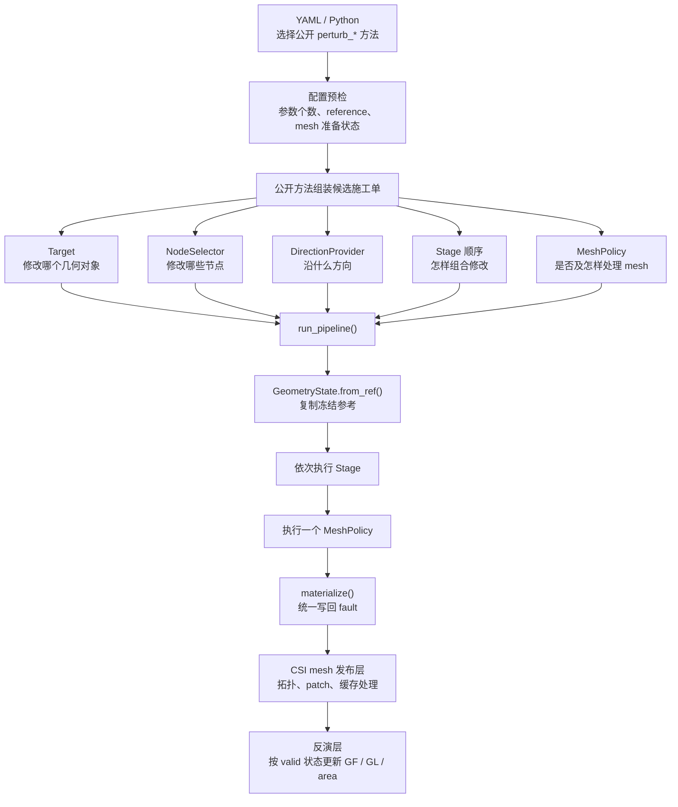

# Bayesian 联合反演中的几何扰动

本页是 `BayesianAdaptiveTriangularPatches` 几何扰动参考的总入口。它帮助用户先确定当前问题
属于哪一个完整阅读单元；具体定义、配置、检查和计算后果集中在对应子页，不要求在多个方法
说明之间来回拼接。

第一次理解 reference、candidate、Pipeline、MeshPolicy 和 cache 的关系，先读
[Bayesian 联合反演中的几何参考](../concepts/bayesian_geometry_reference.md)；需要按顺序运行，读
[联合 Bayesian workflow](../workflows/05_joint_bayesian_geometry_slip.md)。

## 按问题进入

| 当前问题 | 集中阅读页 |
| --- | --- |
| 零扰动几何从哪里来；何时 snapshot；何时重新设基线 | [几何参考的建立与生命周期](geometry_perturbation/reference_lifecycle.md) |
| top/bottom/layer/whole-geometry 的平移、旋转、固定方向、端点或组合方法怎样区分 | [坐标、刚体与组合几何扰动](geometry_perturbation/coordinate_composite.md) |
| `sample_positions`、bounds、动态参数个数和 YAML 怎样对齐 | [几何参数布局与配置路由](geometry_perturbation/parameter_routing.md) |
| 方法是否建 mesh；固定拓扑与 remesh 怎样区分；GF/GL/area 何时更新 | [MeshPolicy、拓扑与派生状态](geometry_perturbation/mesh_cache.md) |
| 局部/代表性/控制点 strike 与沿走向 dip 怎样选择 | [倾角剖面模式总览](dip_profile/index.md) |
| sampled/fixed/transition 怎样组合并诊断 | [Bayesian 倾角剖面组合](dip_profile/bayesian_mixed.md) |
| 正式采样前怎样用 reference top 曲率辅助选择转换带 | [曲率与转换带预分析](dip_profile/transition_preflight.md) |
| 旧 dip setter、fixed nodes、buffer 和 preset 参数怎样替换 | [旧倾角剖面调用迁移](dip_profile/migration.md) |

这些页面按用户任务拆分，不按每个方法名拆分。当前版本的方法清单和签名仍应动态查询：

```bash
ecat-list-fault-perturb-methods
```

```python
fault.help()
fault.help("perturb_bottom_coords_along_fixed_direction")
```

## 共同流转



每个候选只从冻结 reference 构造一次：

```text
candidate_i = transform(frozen_reference, delta_i)
```

Target、selector、direction 和 Stage 决定“改什么、改谁、沿哪里、按什么顺序”；MeshPolicy
决定最终几何如何成为可计算 mesh。`materialize()` 只做统一提交，不重新解释参数。

## 共同不变量

- reference 在同一采样 run 内不可变，候选不从上一候选累积。
- `sample_positions`、bounds 和方法的参数角色必须使用同一顺序。
- whole-mesh 消费者要求同一次 snapshot 的完整 vertices/faces pair。
- 一个候选只执行一个明确 MeshPolicy，不能方法内外重复建 mesh。
- 所有公开扰动向量必须是有限数值；非数值、NaN 或正负无穷在任何几何或缓存状态改变前失败。
- 几何操作只发布 `none/rigid/deform/remesh` 中的一种最终变化性质。
- GF、Laplacian、面积与拓扑缓存由中央映射按需失效，用户配置不直接改 validity。
- `SMC_FJ` 与 `FULLSMC` 共用候选刷新合同；BLSE/VCE 在固定几何上建立独立 inversion。

## 最短采样前检查

```python
assert fault.geometry_ref is not None
fault.geometry_summary()
inversion.print_parameter_positions()
constraint_state = inversion.get_constraint_snapshot(validate=True)
print(constraint_state["validation"])
```

这三项分别检查 fault-local 几何、全局参数布局和约束状态。`fault.help(method)` 是查询方法
签名与 YAML 片段的交互式入口，不需要在每次标准运行中打印。

同时检查参考 top/bottom 点序、下倾侧、方法依赖字段、参数切片与 bounds、极值候选 mesh、
固定拓扑映射，以及 GF/GL/area 的刷新是否符合真实变化。

## 相关页面

- [几何参考概念](../concepts/bayesian_geometry_reference.md)
- [联合 Bayesian 配置短例](../examples/joint_bayesian_geometry_setup.md)
- [联合 Bayesian workflow](../workflows/05_joint_bayesian_geometry_slip.md)
- [Bayesian 联合反演参考](bayesian_joint_inversion.md)
- [断层几何构建](fault_geometry_construction.md)
- [角度约定](../concepts/fault_angle_conventions.md)
